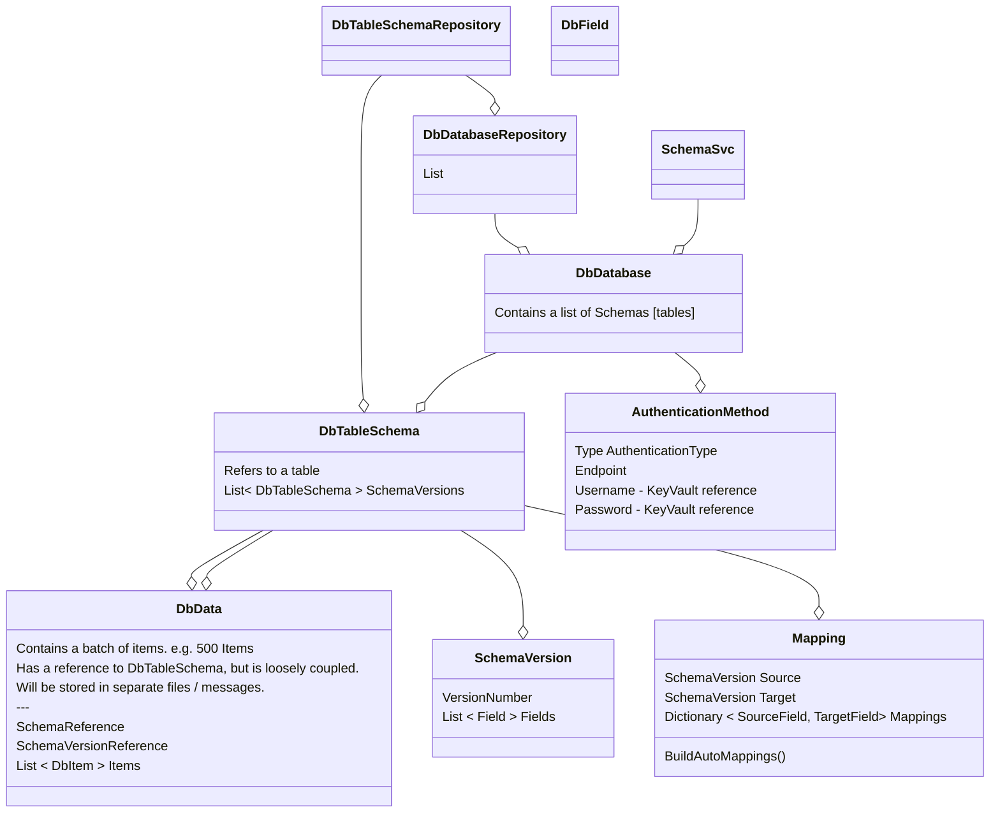

# data mapping 2

## Generic models

```
GenericTable : List<GenericRow>
    GenericRow : DictionaryCaseInsensitive<object> : Dictionary<string, object>

DbData : List<DbItem>
    Guid SchemaId
    DbItem : DictionaryCaseInsensitive<object>

DbValueOperationResponse<T>
    T ResponseValue
    DbOperationResponse OperationResponse
        List<GeneralError> GeneralResponses
        List<DbItemResponse> ItemResponses
            Dictionary<string, object> PrimaryKeys
            DbOperationResponseSeverity Severity
        public List<DbItem> SuccessItems

DbValueListOperationResponse<T>
    List<T> ResponseValue
    List<T> NoMatchItems
    DbOperationResponse OperationResponse 

DbValueMapOperationResponse<T>
    Dictionary<T, T> ResponseValue
    List<T> NoMatchItems
    DbOperationResponse OperationResponse

```


## Diagram: 

This is for the mapping - in the MappingModel folder, containing classes like DbDatabase, DbField, DbItem, DbSchema. 




