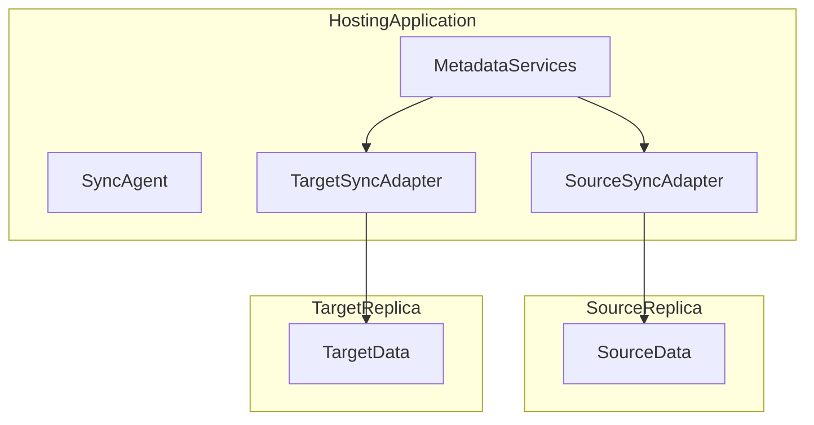
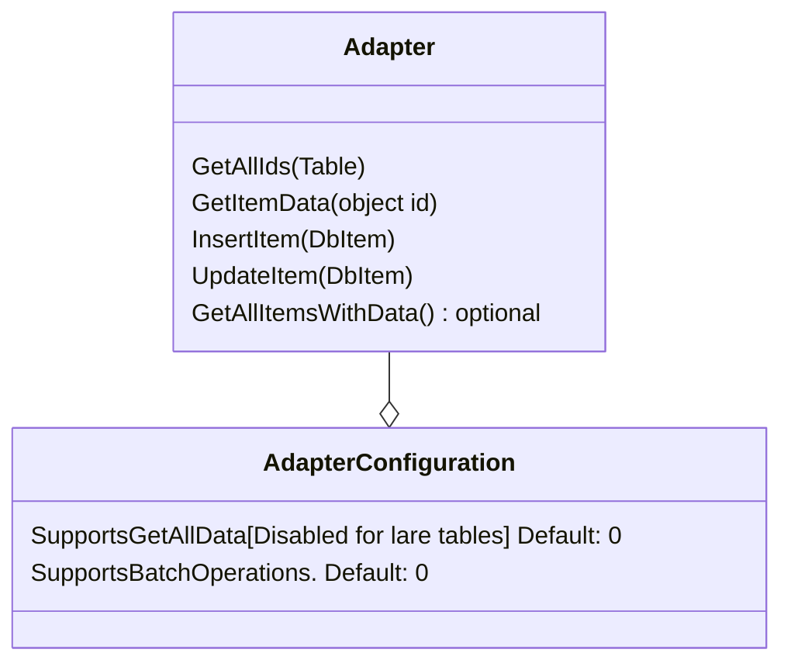

# Microsoft sync framework

Reference: 

https://en.wikipedia.org/wiki/Microsoft_Sync_Framework

# Implement more simple approach

Setup SyncAdapter Interface that can be used for both Source and Target. Sample Methods:
- Get all id's
- Get specific item data (Returns DbItem)
- Insert item
- Update item
- Context / configuration. (Should be possible to handle with DI)
- Get all items with data (Optional. Default implementation gets specific item data for all id's)

Approach to simplify:

- Implement simple sync without thinking microservice. 
- Sync status updated on the go - so sync can be picked up and continued. 
- Setup test sync between two tables.
- Setup test sync between table and table storage.
- Setup test sync between table and SharePoint list. 

Later implement: 
- Event based approach
- Generic table handling. 
- Batch handling of all operations. Maybe using adapter tiers (simple, advanced)

